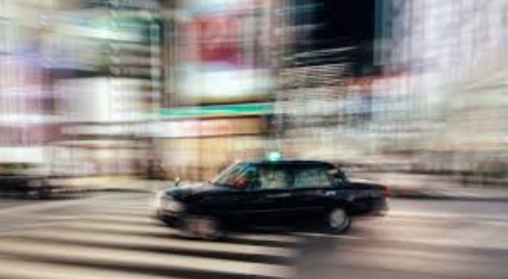
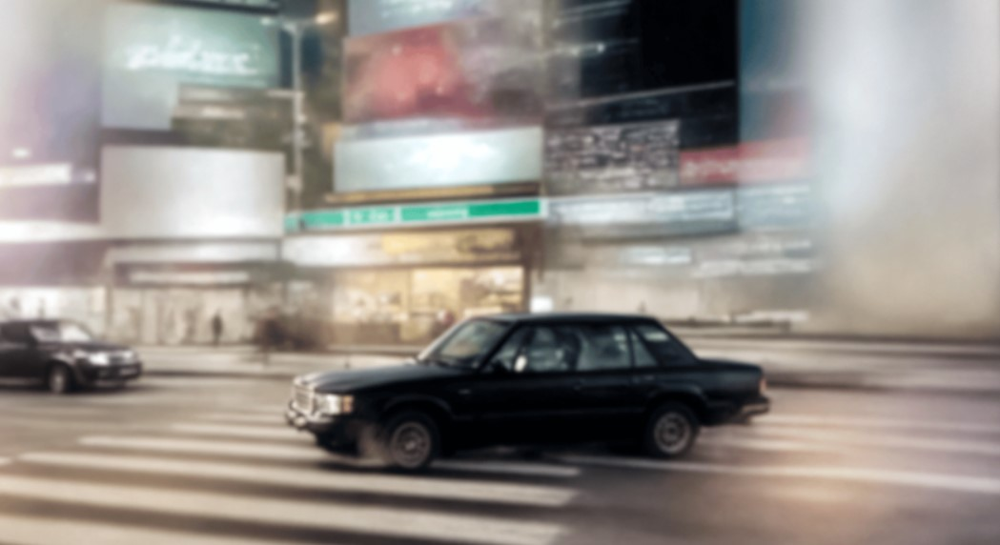

# Generative AI in Computer Vision — A Beginner's Guide

---

## Introduction

What if a computer could not just see the world, but imagine it?

For years, AI in computer vision worked like a detective. You showed it a photo, and it told you what was inside — a face, a car, a dog. It was powerful, but passive. It could only work with images that already existed.

Then everything changed.

A new kind of AI emerged — one that does not just look at images, but creates them. Think of it as the difference between a detective and a painter. The detective observes and identifies. The painter starts with a blank canvas and brings something entirely new into existence.

This is **Generative AI in Computer Vision**: the shift from machines that recognize the world to machines that can imagine it.

---

## Why Does It Matter?

This shift is not just technical — it is practical. Generative AI is already being used to:

- Design clothing and product visuals without a photo shoot
- Generate synthetic training data when real data is scarce or sensitive
- Build creative tools that let anyone produce images from a simple text description
- Accelerate prototyping across design, medicine, gaming, and more

Tools like **Midjourney** and **DALL-E** are just the visible surface. Behind them lie fascinating architectures — GANs, VAEs, and Diffusion Models — each with its own way of "imagining."

---

> The sections that follow will walk you through each of these technologies, step by step, using the same simple language. No prior knowledge required.

---
### 3.2. GANs and VAEs: Two Early Ways for AI to Create Images

Before Diffusion Models became the most popular approach, two important families of generative models helped AI learn how to create images: **GANs** and **VAEs**.

They do not work in the same way, but both have the same big goal:  
**to generate new images that look meaningful, realistic, or similar to the data they learned from.**

In simple words, these models taught machines not only to recognize images, but also to **produce** them.

---

#### 3.2.1. GANs: The "Forger vs. Police Officer"

**GAN** stands for **Generative Adversarial Network**.

A GAN is made of **two neural networks** that compete with each other:

1. **The Generator**: it tries to create a fake image.
2. **The Discriminator**: it checks whether the image is real or fake.

You can imagine this as a game between:

- a **forger**, who tries to paint a fake artwork,
- and a **police officer**, who tries to detect the fake one.

At the beginning, the fake images are poor and easy to detect.  
But after many rounds of training, the forger becomes better and better.  
In the end, the generated images can become very realistic.

    
<em>Simple analogy: the Generator creates, the Discriminator judges.</em>

##### Why are GANs interesting?

GANs became famous because they can generate:

- realistic human faces,
- artistic images,
- fashion designs,
- image-to-image transformations.

They were among the first models to produce highly impressive visual results.

##### Main strength of GANs

The main advantage of GANs is their ability to produce **sharp and realistic images**.

##### Main limitation of GANs

However, GANs can be difficult to train.  
Sometimes, the Generator keeps producing very similar outputs instead of diverse ones. This problem is called **mode collapse**.

In other words, the model may learn only a few "good tricks" instead of learning the full variety of the data.

---

#### 3.2.2. VAEs: The "Compression and Reconstruction Machine"

**VAE** stands for **Variational Autoencoder**.

A VAE works differently from a GAN.  
Instead of using a competition between two networks, it tries to **compress** an image into a simpler internal representation, then **rebuild** it.

A simple analogy is a **compression machine** or a **short cooking recipe**:

- first, the model takes a complex image,
- then it reduces it into a small summary,
- finally, it uses that summary to reconstruct the image or generate a new similar one.

So a VAE learns the "hidden recipe" behind images.

##### How does it work?

A VAE has two main parts:

1. **Encoder**: compresses the image into a compact latent representation.
2. **Decoder**: reconstructs the image from that representation.

This latent space is very useful because it allows the model to generate new images by slightly changing the learned representation.

##### Why are VAEs interesting?

VAEs are useful because they:

- learn a structured representation of data,
- can generate new variations of existing images,
- are easier and more stable to train than GANs.

##### Main limitation of VAEs

The generated images are often **less sharp** and more blurry than GAN-generated images.

So, compared with GANs:

- **GANs** often give more realistic images,
- **VAEs** are often more stable and easier to understand.

---

#### 3.2.3. GANs vs. VAEs: A Simple Comparison

Both models are important in the history of Generative AI in Computer Vision.

- **GANs** focus on realism through competition.
- **VAEs** focus on learning a compact representation and reconstructing images.

A very simple way to remember them is:

- **GAN = a battle between creator and judge**
- **VAE = compress, understand, and rebuild**

| Model | Main Idea | Strength | Weakness |
|-------|-----------|----------|----------|
| **GAN** | Create through competition | Very realistic images | Hard to train, mode collapse |
| **VAE** | Compress then reconstruct | Stable and structured learning | Blurrier images |

---

#### 3.2.4. Why They Still Matter

Even if newer models like Diffusion Models now achieve better results in many cases, GANs and VAEs remain essential because they introduced key ideas in generative AI.

They helped researchers answer an important question:

> How can a machine learn not only to see an image, but also to imagine a new one?

They are also important because they prepared the path for the more advanced image generation systems used today.

---

#### Transition to the Next Model

GANs and VAEs were major steps in the evolution of Generative AI.  
But researchers still wanted models that were more stable, more controllable, and better at generating diverse high-quality images.

This is why **Diffusion Models** became so important.

In the next section, we will see how these models start from pure noise and gradually build a clear image step by step.

### 3.3. Diffusion Models: The "Noise Cleaners"

Diffusion Models represent the current state-of-the-art in Computer Vision. Unlike previous architectures, they rely on a process called **Iterative Denoising**. This is the core engine behind **Midjourney**, **DALL-E 3**, and **Stable Diffusion**.
In simple terms – “Diffusion Models are a class of probabilistic generative models that turn noise to a representative data sample.”
Using Diffusion models, we can generate images either conditionally or unconditionally.
Unconditional image generation simply means that the model converts noise into any “random representative data sample.” The generation process is not controlled or guided, and the model can generate an image of any nature.
Conditional image generation is where the model is provided additional information via text (text2img) or class labels (like in CGANs). This is a case of guided or controlled image generation. By providing by passing additional information, we expect the model to generate specific sets of images. 

    
    
<em>Figure 1 : Unconditional vs. Conditional Diffusion. The process can create a representation from noise (top arrow) or follow instructions like class labels or text to generate a specific object, such as this flower.</em>

In Generative AI, the process works in two main phases:
1. **Forward Diffusion (Adding Noise):** We take a clear image and gradually add Gaussian noise until it becomes a "pure noise" image (total randomness).
2. **Reverse Diffusion (Learning to Denoise):** The AI (usually a U-Net architecture) is trained to predict and subtract that noise. It looks at a grainy image and "cleans" it step-by-step to reveal a crisp result based on your prompt.
---
#### Why is it the favorite method today?
According to technical benchmarks, Diffusion Models overcome a major flaw of GANs (which often suffer from "Mode Collapse" or unstable training).

* **Unmatched Realism:** They capture much finer details (textures, lighting).
* **Prompt Adherence:** They are better at understanding complex "Text-to-Image" descriptions.
* **Iterative Refinement:** Since the process is step-by-step, we can control the generation at any point.
#### Benchmarking Generative Architectures
To understand why Diffusion Models have become the industry standard, we must compare them to other generative approaches like VAEs and GANs. While GANs are known for their speed, they often suffer from "Mode Collapse," limiting the diversity of their output. Diffusion models, however, prioritize **high sample quality** and **extreme diversity**, making them the superior choice for complex creative tasks, despite requiring more computational time for the denoising process.
### Comparison with other Models

The following table summarizes the trade-offs between the four main types of generative architectures:

    
    
<em>Figure 2 : Pros and Cons of VAE, Flow, GAN, and Diffusion models.</em> 
    source : learnopencv.com

As highlighted in the table, the **Diffusion** model's main "Con" is a low sampling rate (due to its iterative nature), but it compensates by providing the highest generation quality and diversity currently available in AI.

#### Practical Example: Noise Removal in Action
DreamStudio is the official web-based interface developed by Stability AI for **Stable Diffusion**. It is an excellent example of how complex Diffusion Models are made accessible to users.
To better understand how this works, look at the transition below. The model starts with a highly pixelated and "noisy" version of the scene (the car and the city background). Through several iterations of the **Reverse Diffusion** process, it intelligently predicts what the details should look like, gradually sharpening the edges and textures until a clear, high-quality image is revealed. This isn't just "unblurring"—it's the AI reconstructing the scene based on its deep understanding of visual patterns.

  
  
  
  
Figure 3 : Evolution of the Denoising Process from blurry to sharp

**How to use it:**
* **Interface:** Unlike Midjourney (Discord-based), DreamStudio offers a clean web UI where you can directly enter your prompts.
* **The Generation:** To create an image, you enter your description (prompt) and click "Dream." This triggers the underlying Stable Diffusion model to begin its Iterative Denoising process.
* **Advanced Control:** DreamStudio is unique because it allows you to visualize how Diffusion parameters (like the number of "Steps") directly affect image quality and generation time.

**Example : Real-World Accuracy: High-Resolution Generation**
To demonstrate the incredible power of Stable Diffusion, we generated a series of portraits using a complex prompt focused on fine details (wrinkles, skin texture, lighting). 

As seen in the images below, the model doesn't just "stretch" pixels; it understands the structure of a human face. By removing noise strategically, it can create hyper-realistic features that are almost indistinguishable from real photography. This illustrates the **Unmatched Realism** strength we mentioned earlier: the ability to handle intricate patterns and cinematic lighting with high fidelity.

  
  
  
Figure 4 : High-resolution close-up portrait of an elderly man with detailed wrinkles, soft studio lighting, photorealistic, extremely detailed face.

## 4. Simple Comparison

| | 🟣 GAN — The Forger & the Detective | 🟢 VAE — The Sketch Artist | 🟠 Diffusion — The Puzzle Solver |
|---|---|---|---|
| **How it works** | Two AIs play a game: one draws fakes, the other catches them. They improve until the fakes look real. | Squishes an image into a tiny secret code, then redraws it from that code. | Covers an image with noise until it disappears, then learns to reverse the process. |
| **Good at** | Sharp realistic images, fast generation, lots of variety | Easy to edit, reliable training, steerable output | Best quality today, works with text prompts |
| **Not great at** | Can get stuck, hard to control, tricky to evaluate | Images can be blurry, small details get lost | Slow, needs a lot of computing power |
| **Used for** | Fake face generation, super-resolution, training data | Anomaly detection, photo editing | DALL·E, Stable Diffusion, inpainting |
---
