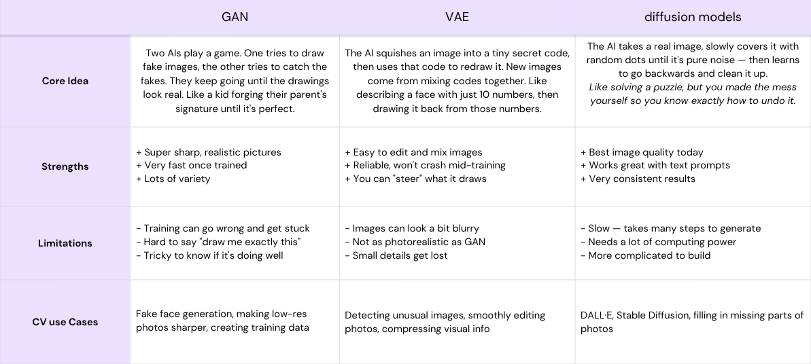

# Generative AI in Computer Vision — A Beginner's Guide

---

## 1. Introduction

What if a computer could not just see the world, but imagine it?

For years, AI in computer vision worked like a detective. You showed it a photo, and it told you what was inside — a face, a car, a dog. It was powerful, but passive. It could only work with images that already existed.

Then everything changed.

A new kind of AI emerged — one that does not just look at images, but creates them. Think of it as the difference between a detective and a painter. The detective observes and identifies. The painter starts with a blank canvas and brings something entirely new into existence.

This is **Generative AI in Computer Vision**: the shift from machines that recognize the world to machines that can imagine it.

---

## 2. Why Does It Matter?

This shift is not just technical — it is practical. Generative AI is already being used to:

- **Design clothing and product visuals** without a photo shoot.
- **Generate synthetic training data** when real data is scarce or sensitive.
- **Build creative tools** that let anyone produce images from a simple text description.
- **Accelerate prototyping** across design, medicine, gaming, and more.

Tools like **Midjourney** and **DALL-E** are just the visible surface. Behind them lie fascinating architectures — GANs, VAEs, and Diffusion Models — each with its own way of "imagining."

---

> The sections that follow will walk you through each of these technologies, step by step, using the same simple language. No prior knowledge required.

---

## 3. Core Technologies

### 3.1. GANs and VAEs: Two Early Ways for AI to Create Images

Before Diffusion Models became the most popular approach, two important families of generative models helped AI learn how to create images: **GANs** and **VAEs**.

They do not work in the same way, but both have the same big goal:  
**To generate new images that look meaningful, realistic, or similar to the data they learned from.**

In simple words, these models taught machines not only to recognize images, but also to **produce** them.

---

#### 3.1.1. GANs: The "Forger vs. Police Officer"

**GAN** stands for **Generative Adversarial Network**. It is made of **two neural networks** that compete with each other:

1. **The Generator**: It tries to create a fake image.
2. **The Discriminator**: It checks whether the image is real or fake.

Imagine a game between a **forger**, who tries to paint a fake artwork, and a **police officer**, who tries to detect the fake. Over time, the forger becomes so skilled that the officer can no longer tell the difference.

* **Main Strength**: Ability to produce **sharp and realistic images**.
* **Main Limitation**: They can be difficult to train. Sometimes the Generator produces very similar outputs (e.g., only one type of face). This is called **Mode Collapse**.

---

#### 3.1.2. VAEs: The "Compression and Reconstruction Machine"

**VAE** stands for **Variational Autoencoder**. Instead of competition, it uses a **compression** logic:

1. **Encoder**: Compresses the image into a compact "latent representation" (a secret recipe).
2. **Decoder**: Reconstructs the image from that representation.

* **Main Strength**: Very stable and structured learning.
* **Main Limitation**: The generated images are often **less sharp** and more blurry than GAN-generated images.

---

### 3.2. Diffusion Models: The "Noise Cleaners"

Diffusion Models represent the current state-of-the-art. They rely on a process called **Iterative Denoising**. This is the core engine behind **Midjourney** and **Stable Diffusion**.

#### How it works:
1.  **Forward Diffusion (Adding Noise):** We take a clear image and gradually add noise until it becomes "pure noise" (random pixels).
2.  **Reverse Diffusion (Learning to Denoise):** The AI is trained to "clean" that noise step-by-step to reveal a crisp result based on your prompt.

    
    
<em>Figure 1: Unconditional vs. Conditional Diffusion.</em>

#### Why is it the favorite method today?
* **Unmatched Realism:** Captures much finer details (textures, lighting).
* **Prompt Adherence:** Better at understanding complex "Text-to-Image" descriptions.
* **No Mode Collapse:** Unlike GANs, they are much more stable during training.

---

## 4. Benchmarking & Comparison

To understand why Diffusion Models have become the industry standard, we can compare the four main types of generative architectures:

    
    
<em>Figure 2: Pros and Cons of VAE, Flow, GAN, and Diffusion models. Source: learnopencv.com</em>

### Summary Table

| Model | Main Idea | Strength | Weakness |
|-------|-----------|----------|----------|
| **GAN** | Battle between creator & judge | Very realistic & sharp | Hard to train, Mode Collapse |
| **VAE** | Compress, understand, rebuild | Stable & structured | Often produces blurry results |
| **Diffusion**| Turning noise into data | Highest quality & diversity | Slow sampling (iterative) |

---

## 5. Practical Example: Denoising in Action

Using **DreamStudio** (Stable Diffusion), we can see how the model intelligently predicts what details should look like, gradually sharpening the edges until a clear image is revealed.

  
  
  
  
<em>Figure 3: Evolution of the Denoising Process from blurry to sharp.</em>

### Real-World Accuracy: High-Resolution Generation
The model doesn't just "stretch" pixels; it understands the structure of a human face, allowing it to create hyper-realistic features.

  
  
  
<em>Figure 4: High-resolution close-up portrait demonstrating skin texture and lighting fidelity.</em>

---

## 6. Key Takeaways

  
  
<em>Figure 5: Key differences between GAN, VAE, and Diffusion Models.</em>

GANs and VAEs prepared the path, but **Diffusion Models** are currently leading the way in "Imagining the world" with high fidelity and stability.
